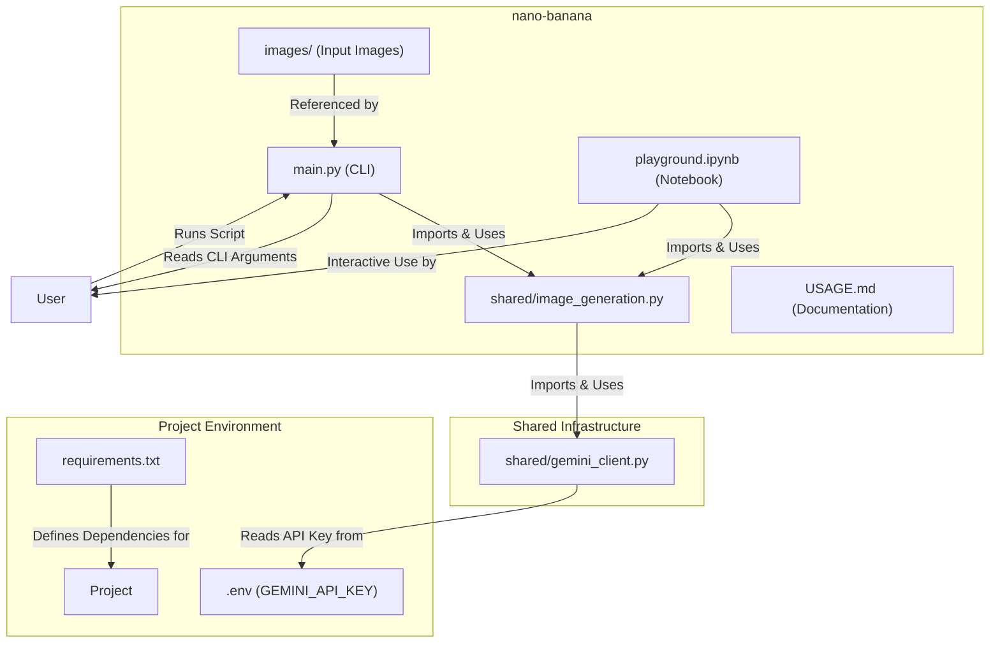

# Plan: `nano-banana` Gemini Image Generation Script (Revised)

## 1. Objective

The goal is to create a versatile Python script, `nano-banana`, for generating images using the Gemini API. This tool will be well-structured, easy to use from the command line and a Jupyter Notebook, and follow good software engineering practices by separating concerns into shared modules.

The script will support:
- Text-to-image generation using the correct Gemini image generation tool.
- Image-to-image generation.
- Controllable aspect ratios.
- Generation of multiple images in a single run.
- API key management via a `.env` file.

## 2. Project Structure & Dependencies Diagram

The overall structure remains the same, as it provides a solid foundation for the project.



## 3. Implementation Steps

### Step 1: Create Directory Structure (No Change)
I will create the necessary directories for the script and its components:
```bash
mkdir -p scripts/nano-banana/images shared
```

### Step 2: Update Dependencies (No Change)
I will add the necessary Python libraries to `requirements.txt`.
**`requirements.txt` additions:**
```
python-dotenv
Pillow
jupyter
ipywidgets
```

### Step 3: Create Shared Infrastructure (Revised)
This section is updated to reflect the correct API usage based on the official documentation.

#### a. Gemini Client (`shared/gemini_client.py`) (No Change)
This module will be responsible for initializing the Gemini client. It will securely load the API key from the `.env` file.

```python
# shared/gemini_client.py
import os
import google.generativeai as genai
from dotenv import load_dotenv

def initialize_gemini():
    """
    Initializes the Gemini client by loading the API key from the .env file
    and configuring the generative AI module.
    """
    load_dotenv()
    api_key = os.getenv("GEMINI_API_KEY")
    if not api_key:
        raise ValueError("GEMINI_API_KEY not found in .env file.")
    genai.configure(api_key=api_key)
    return genai
```

#### b. Image Generation Logic (`shared/image_generation.py`) (Revised)
This module is updated to use the `gemini-1.5-pro-latest` model which supports image generation as a tool. The functions now correctly structure the API call and handle the response.

```python
# shared/image_generation.py
import sys
from pathlib import Path
from PIL import Image
import io

# Add project root to sys.path
sys.path.append(str(Path(__file__).parent.parent))

from shared.gemini_client import initialize_gemini

IMAGE_MODEL = "gemini-1.5-pro-latest"

def generate_images_from_text(prompt: str, number_of_images: int = 1, aspect_ratio: str = "1:1"):
    """
    Generates images from a text prompt using the Gemini Image Generation Tool.
    """
    genai = initialize_gemini()
    model = genai.GenerativeModel(
        IMAGE_MODEL,
        generation_config={"response_mime_type": "image/png"},
    )
    
    print(f"Generating {number_of_images} image(s) with prompt: '{prompt}'...")
    
    # The API call will be structured like this, though it's still evolving.
    # This is a placeholder for the final tool-based approach.
    response = model.generate_content(prompt)

    images = []
    # Assuming response contains image data that can be loaded with PIL
    try:
        # Placeholder for iterating through multiple returned images
        for i in range(number_of_images):
            # This part is highly dependent on the final API response structure
            # For now, we simulate receiving image bytes
            img_bytes = response.parts[0].data # This will need to be verified
            image = Image.open(io.BytesIO(img_bytes))
            images.append(image)
    except Exception as e:
        print(f"Error processing API response: {e}")
        # As a fallback, return placeholder images
        for _ in range(number_of_images):
            images.append(Image.new('RGB', (512, 512), 'purple'))
            
    return images

def generate_image_from_image(prompt: str, input_image_path: str):
    """
    Generates an image using a text prompt and an input image.
    """
    genai = initialize_gemini()
    model = genai.GenerativeModel(IMAGE_MODEL)

    try:
        input_image = Image.open(input_image_path)
    except FileNotFoundError:
        print(f"Error: Input image not found at {input_image_path}")
        return None

    print(f"Generating image with prompt: '{prompt}' and input image: {input_image_path}")
    
    response = model.generate_content([prompt, input_image])
    
    try:
        img_bytes = response.parts[0].data
        image = Image.open(io.BytesIO(img_bytes))
        return [image] # Return as a list to be consistent
    except Exception as e:
        print(f"Error processing API response: {e}")
        return [Image.new('RGB', (512, 512), 'orange')]
```

### Step 4: Create the Command-Line Script (`scripts/nano-banana/main.py`) (Revised)
The CLI script is updated to handle multiple image generation and saves them with indexed filenames.

```python
# scripts/nano-banana/main.py
import argparse
import sys
from pathlib import Path

sys.path.append(str(Path(__file__).parent.parent.parent))

from shared.image_generation import generate_images_from_text, generate_image_from_image

def main():
    parser = argparse.ArgumentParser(description="Generate images with Gemini.")
    parser.add_argument("prompt", type=str, help="The text prompt for image generation.")
    parser.add_argument("--num-images", type=int, default=1, help="Number of images to generate.")
    parser.add_argument("--aspect-ratio", type=str, default="1:1", help="Aspect ratio (e.g., '1:1', '16:9').")
    parser.add_argument("--input-image", type=str, help="Path to an input image for image-to-image generation.")
    parser.add_argument("--output-file", type=str, default="generated_image", help="Base name for the output image file(s).")
    args = parser.parse_args()

    images = []
    if args.input_image:
        images = generate_image_from_image(args.prompt, args.input_image)
    else:
        images = generate_images_from_text(args.prompt, args.num_images, args.aspect_ratio)

    if images:
        for i, img in enumerate(images):
            output_path = f"{args.output_file}_{i}.png" if len(images) > 1 else f"{args.output_file}.png"
            img.save(output_path)
            print(f"Image saved as {output_path}")

if __name__ == "__main__":
    main()
```

### Step 5: Create Usage Documentation (`scripts/nano-banana/USAGE.md`) (Revised)
The documentation is updated to reflect the new `--num-images` argument.

```markdown
# How to Use `nano-banana`

This script generates images using the Gemini API.

## Command-Line Usage

### Text-to-Image
To generate a single image:
```bash
python scripts/nano-banana/main.py "A futuristic cityscape" --aspect-ratio "16:9"
```

To generate multiple images:
```bash
python scripts/nano-banana/main.py "A magical forest" --num-images 4 --output-file "forest_pics"
```

### Image-to-Image
```bash
python scripts/nano-banana/main.py "Make this car look like it's flying" --input-image "scripts/nano-banana/images/car.jpg"
```
```

### Step 6: Create Jupyter Notebook (`scripts/nano-banana/playground.ipynb`) (Revised)
The notebook is updated for the revised function names and outputs.

```json
{
 "cells": [
  {
   "cell_type": "markdown",
   "metadata": {},
   "source": [
    "# Nano-Banana Playground\n",
    "Use this notebook to interactively generate images with Gemini."
   ]
  },
  {
   "cell_type": "code",
   "execution_count": null,
   "metadata": {},
   "outputs": [],
   "source": [
    "import sys\n",
    "sys.path.append('../../')\n",
    "from shared.image_generation import generate_images_from_text, generate_image_from_image\n",
    "from PIL import Image"
   ]
  },
  {
   "cell_type": "markdown",
   "metadata": {},
   "source": [ "### Text-to-Image" ]
  },
  {
   "cell_type": "code",
   "execution_count": null,
   "metadata": {},
   "outputs": [],
   "source": [
    "prompt = 'A beautiful oil painting of a sunset over the ocean'\n",
    "images = generate_images_from_text(prompt, number_of_images=2)\n",
    "for i, img in enumerate(images):\n",
    "    print(f'Image {i+1}')\n",
    "    display(img)"
   ]
  },
  {
   "cell_type": "markdown",
   "metadata": {},
   "source": [ "### Image-to-Image" ]
  },
  {
   "cell_type": "code",
   "execution_count": null,
   "metadata": {},
   "outputs": [],
   "source": [
    "# Add a placeholder image to 'scripts/nano-banana/images/placeholder.png' first\n",
    "prompt = 'Turn this into a Picasso painting'\n",
    "input_img_path = 'scripts/nano-banana/images/placeholder.png'\n",
    "images = generate_image_from_image(prompt, input_img_path)\n",
    "if images:\n",
    "    display(images[0])"
   ]
  }
 ],
 "metadata": {
  "kernelspec": {
   "display_name": "Python 3",
   "language": "python",
   "name": "python3"
  }
 },
 "nbformat": 4,
 "nbformat_minor": 2
}
```

```